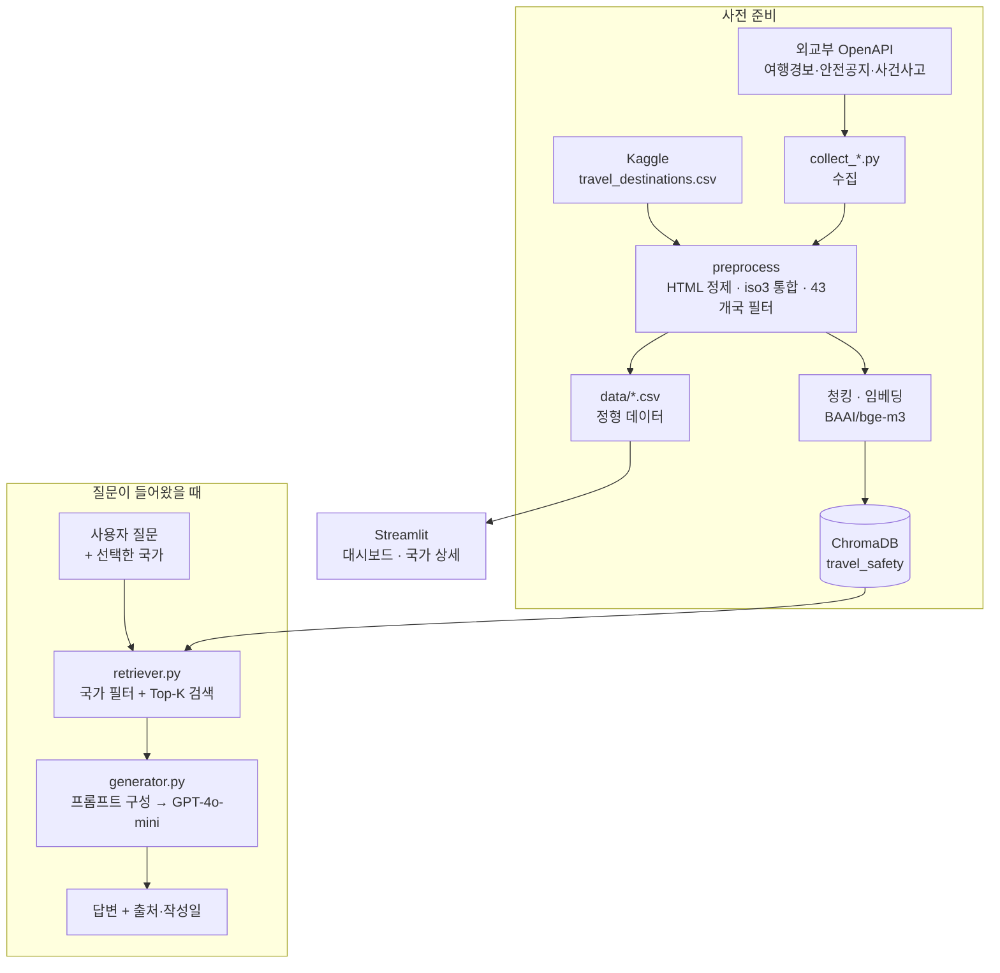

# 🌐 해외여행 안전정보 서비스

> 외교부 여행경보·안전공지·사건사고 데이터를 수집·전처리하고, 근거와 함께 답하는 RAG 챗봇과 분석 대시보드를 하나의 Streamlit 앱으로 제공합니다.

🔗 데모: (배포 URL 또는 "로컬 실행") · 📊 분석 보고서: (링크) · 📓 팀 노션: (링크)

---

## 1. 프로젝트 소개

- **문제**: 해외여행을 준비할 때 여행경보, 현지 사건사고, 안전공지가 각각 다른 곳에 흩어져 있어 한 번에 확인하기 어렵습니다. 외교부 사이트에서 국가를 일일이 찾아 들어가야 하고, 원하는 정보가 어느 페이지에 있는지도 알기 어렵습니다.
- **해결**: 국가별 안전정보를 한 화면에 모아 보여주고, 자연어로 질문하면 실제 외교부 문서를 근거로 답합니다. 여행지·시기 추천 데이터도 함께 제공해 **어디로 갈지**부터 **무엇을 조심할지**까지 이어서 확인할 수 있습니다.
- **기간 / 팀**: 2026.08.19 ~ 2026.08.22 (4일) / 3명

## 2. 웹 UI

| 메인 | 통계 대시보드 |
| --- | --- |
|  |  |

| 국가 상세 | 안전 Q&A (출처 표기) |
| --- | --- |
|  |  |

## 3. 주요 기능

- **국가별 안전정보 조회** — 국가를 선택하면 여행경보 단계, 지역별 경보, 사건사고 유형, 최신 안전공지를 한 화면에서 확인합니다.
- **통계 대시보드** — 세계지도 기반 경보 현황, 국가별 안전정보 등록 건수 TOP 10, 대륙별 월간 안전공지 추이를 제공합니다.
- **근거 기반 챗봇** — 질문에 답할 때 참조한 외교부 문서와 작성일을 함께 표시하고, 근거를 찾지 못하면 자료가 없다고 답합니다.
- **여행지·시기 추천 연계** — 추천 데이터가 있는 43개국은 추천 도시·테마·방문 시기를 함께 표시합니다.

## 4. 아키텍처



## 5. 기술 스택

| 구분 | 사용 기술 |
| --- | --- |
| 언어 / 환경 | Python, uv |
| 데이터 | pandas |
| 임베딩 | BAAI/bge-m3 |
| LLM | OpenAI GPT-4o-mini |
| RAG | LangChain, ChromaDB |
| 앱 | Streamlit, Plotly |
| 협업 | GitHub, Notion |

## 6. 데이터

| 데이터 | 출처 | 원본 | 처리 후 | 활용 |
| --- | --- | --- | --- | --- |
| 여행경보 | 외교부_국가·지역별 여행경보 목록 조회(0404 대륙정보) | 208건 | 173건 / 117개국 | 지도, 경보단계 |
| 안전공지 | 외교부_국가·지역별 안전공지 | 5,957건 | 3,647건 / 117개국 | RAG, 최신 공지 |
| 안전정보 | 외교부_국가별 안전정보 | (확인 필요) | 4,270건 / 117개국 | 통계 자료 |
| 사건사고 | 외교부_국가·지역별 사건사고 유형 | 198건 | 117건 / 117개국 | RAG, 유형 태그 |
| 여행지 테마 | Kaggle travel_destinations.csv | 111행 / 44개국 | 111행 / 44개국 | 추천 |

> RAG 인덱싱: 안전공지 3,647건 + 사건사고 117건 → 청킹 후 **7,026 청크** (ChromaDB `travel_safety`)

- **주요 컬럼**: `국가명`, `iso2/iso3`, `경보단계`, `경보내용`, `공지제목`, `공지내용_텍스트`, `안전공지_작성일`, `사건사고내용`
- **전처리 요약**
  - HTML 엔티티 제거 (`html.unescape` 후 `\xa0` 추가 처리)
  - 본문이 비어 있는 행 제외 (안전공지 666건)
  - 모든 데이터셋을 ISO 코드 기준으로 연결 — 한국어 국가명은 표기가 달라 조인에 실패
  - 국가명 수동 보정 2건: `Turkey(터키) → 튀르키예`, `USA(미합중국) → 미국`
  - `keep_default_na=False` 적용 — 나미비아 iso2 코드 `NA`가 결측으로 읽히는 문제 방지
  - 빈 청크 제거 후 벡터 DB 재구축 (7,808 → 7,026 문서)
- **한계**: 사건사고 데이터의 최신 게시일이 약 2년 전입니다. 시의성은 최신 안전공지 데이터로 보완했습니다.
- **상세 명세**: (데이터 명세서 링크) · (전처리 명세서 링크)

## 7. 실행 방법

### 사전 준비

- Python, uv
- OpenAI API Key

### 설치

```bash
git clone https://github.com/encore-ai-campus/mle-01-p1-team5.git
cd mle-01-p1-team5
uv sync
```

### 환경 변수

`.env.example`을 복사해 `.env`를 만들고 키를 채웁니다.

```
OPENAI_API_KEY=your_key_here
```

### 수집 → 인덱싱 → 실행

```bash
uv run python src/collect_alarm.py          # 1) 여행경보 수집
uv run python src/collect_safety.py         # 2) 안전정보 수집
uv run python src/collect_safety_notice.py  # 3) 안전공지 수집
uv run python src/collect_incident.py       # 4) 사건사고 수집                                  
uv run python src/preprocess_alarm.py       # 5) 전처리
uv run python src/preprocess_safety.py
uv run python src/preprocess_destinations.py
uv run python src/incident_clean.py
uv run python src/filter_common_countries.py
uv run python src/build_vector_db.py        # 6) 임베딩·적재
uv run streamlit run HOME.py                # 7) 앱 실행
```

> `data/vector_db/`는 용량 문제로 커밋하지 않았습니다.

## 8. 프로젝트 구조

```
mle-01-p1-team5/
├── data/
│   ├── raw/                        # 수집 원본
│   │   ├── alarm.json
│   │   ├── safety_info.json
│   │   └── travel_destinations.csv
│   ├── processed/                  # 최종 산출물
│   │   ├── alarm_final.csv
│   │   ├── country_dashboard.csv
│   │   ├── incident_final.csv
│   │   ├── safety_final.csv
│   │   └── safety_notice_final.csv
│   ├── vector_db/                  # ChromaDB (7,026 문서)
│   │   └── chroma.sqlite3
│   ├── country_master.csv          # 43개국 매칭표 (조인 키 사용)
│   ├── alarm_clean.csv
│   ├── destinations_clean.csv
│   ├── incident_info_clean.csv
│   ├── safety_clean.csv
│   └── safety_stats.csv
│
├── notebooks/                      # EDA (eda.ipynb, pre_alm.ipynb 등)
│
├── outputs/
│   └── charts/
│
├── pages/                          # Streamlit 하위 페이지
│   ├── 1_통계_대시보드.py
│   ├── 2_국가_상세.py
│   └── 3_안전_QnA.py
│
├── scripts/
│   └── run_eval.py                 # 평가셋 27문항 일괄 실행 (generator)
│
├── src/
│   ├── collect_alarm.py            # ── 수집
│   ├── collect_safety.py
│   ├── collect_safety_notice.py
│   ├── collect_incident.py
│   ├── preprocess_alarm.py         # ── 전처리
│   ├── preprocess_safety.py
│   ├── preprocess_destinations.py
│   ├── incident_clean.py
│   ├── filter_common_countries.py
│   ├── build_vector_db.py          # ── RAG
│   ├── retriever.py
│   ├── generator.py
│   ├── retriever_evaluation.py
│   ├── build_country_dashboard.py  # ── 117개 국가 추출
│   ├── country_detail.py
│   ├── alarm_stats.py
│   ├── viz_map.py
│   └── sidebar.py
│
├── docs/
│
├── HOME.py                         # Streamlit 메인 페이지
├── eval_result.md                  # generator 평가 리포트
├── pyproject.toml
├── uv.lock
├── .env.example
└── README.md
```

## 9. 팀 소개

| 이름 | 역할 | 담당 | GitHub |
| --- | --- | --- | --- |
| **엄가현** | 팀장 · Generator | 주제 기획 · 데이터 설계(국가 매칭표, 조인 키) · 수집 · 전처리 · 프롬프트 엔지니어링 · LLM 연동 · Streamlit UI | @Gahyun0121 |
| **현유진** | Retriever | 수집 · 전처리 · 청킹 · 임베딩 · 벡터 DB 구축 · 검색 · Streamlit 배포 | @ynjiu |
| **조자룡** | Evaluation | 수집 · 전처리 · 평가셋 구축 · 검색 품질 측정 · 리포트 · 통계 대시보드 | @jajoryong |

## 10. 회고 (KPT)

- **엄가현**: 
    - **Keep**
        - 컬럼이 각자 다른 데이터들을 iso코드로 조인 키를 정하여 데이터를 통합하였다. 
        - 검색 담당 팀원과 주고받을 데이터 형식을 미리 정해둬서 검색 코드가 완성되기 전에도 가짜 데이터로 프롬프트를 먼저 만들 수 있었다.
    - **Problem**
        - 프롬프트 규칙을 과하게 걸어 문서 5건을 받고도 '자료 없음'이 나왔다. 검색 건수를 먼저 확인해 원인이 프롬프트임을 특정하고 규칙을 완화했다.
    - **Try**
        - 값을 정할 때는 데이터의 실제 분포를 보고 정하기
        - 팀원과 경로·파일명 규칙을 초반에 합의하기
- **현유진**:
    - **Keep**
        - 데이터 전처리와 분석을 진행하면서 목적에 맞는 데이터와 컬럼을 선택하는 과정이 중요하다는 것을 배웠다.
        - RAG를 직접 구축하면서  수업에서 배운 개념들이 실제로 어떻게 연결되는지 이해할 수 있었다.
    - **Problem**
        - `chunk_id` 누락과 빈 Chunk를 뒤늦게 발견해 임베딩을 다시 진행하면서 중간 결과에 대한 검증이 부족했음을 느꼈다.
        - 문제가 연속해서 발생하면 마음이 급해져 충분히 확인하지 못하는 경향이 있었다.
    - **Try**
        - 다음 프로젝트에서는 단계별 검증 기준을 정하고, 시간이 오래 걸리는 작업은 소량의 데이터로 먼저 테스트한 후 진행하겠다.
        - AI를 효율적으로 활용하되 주요 로직과 데이터 흐름은 충분히 이해하고 넘어가겠다.
- **조자룡**:
    - **Keep**
        - Git을 활용해 브랜치를 생성하고 작업 내용을 공유하며 팀원들과 협업하는 과정을 경험할 수 있었다.
        - 데이터 수집부터 전처리, 분석, RAG 구축, 웹페이지 구현까지 진행하며 프로젝트의 전체적인 흐름을 경험하고 이해할 수 있었다.
    - **Problem**
        - 데이터 전처리가 충분히 이루어지지 않은 상태에서 프로젝트를 진행하여 이후 검색 및 활용 과정에서 문제가 발생했다.
        - Retriever가 정답 청크를 가져오지 못했을 때 Retriever의 검색 결과와 평가를 위한 Gold Set을 어떻게 구분해야 하는지 기준을 잡는 데 어려움이 있었다.
    - **Try**
        - 이번 프로젝트를 통해 전체적인 개발 흐름을 경험한 만큼, 다음 프로젝트에서는 각 단계의 역할과 연결 과정을 충분히 학습하고 이해한 후 프로젝트에 적용해보고 싶다.
