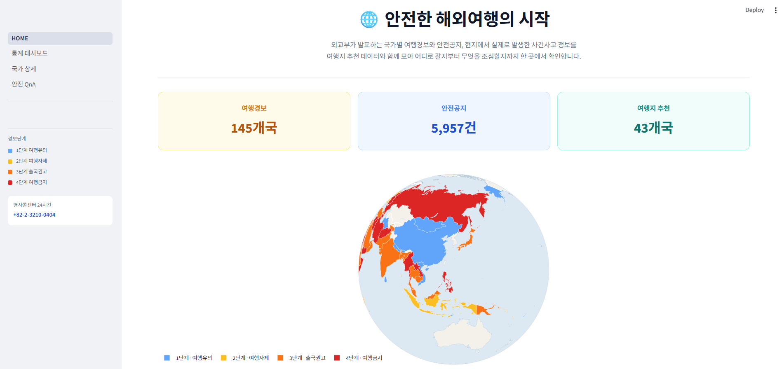
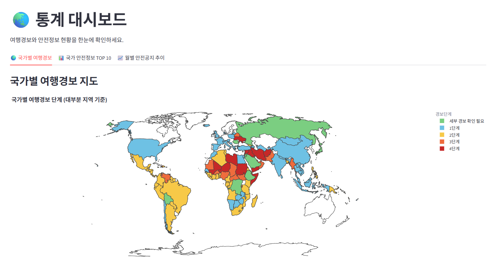
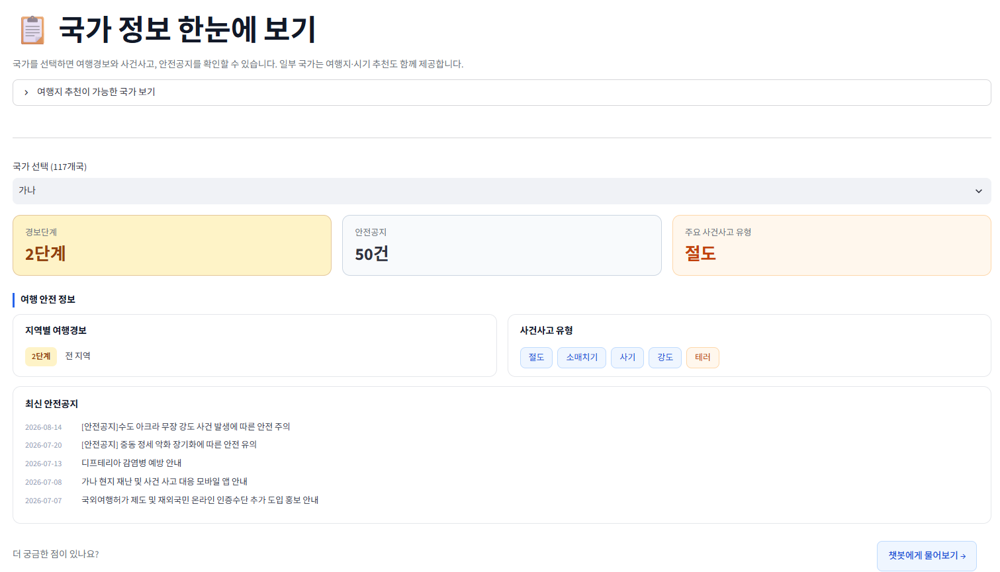
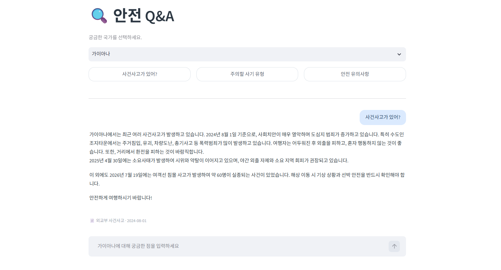
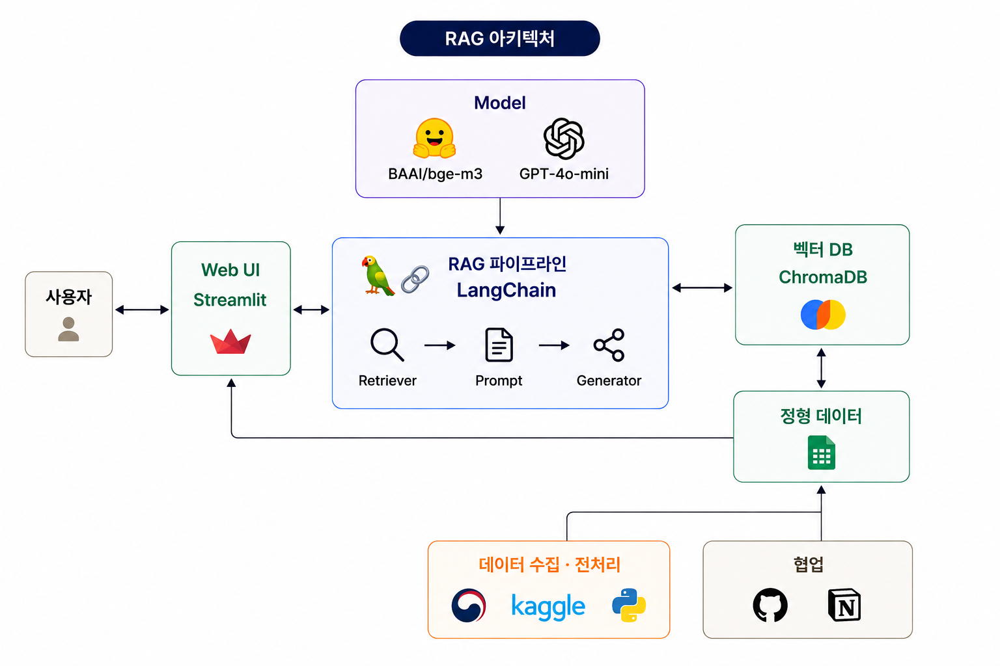

# 🌐 트립가드 (TripGuard)

> 외교부 여행경보·안전공지·사건사고 데이터를 수집·전처리하고, 근거와 함께 답하는 RAG 챗봇과 분석 대시보드를 하나의 Streamlit 앱으로 제공합니다.

🔗 데모: [🌐 트립가드](https://mle-01-p1-team5-vyx7lscyjye2bon7hj5wgz.streamlit.app/) · 📊 분석 보고서: [EDA 분석 보고서](https://github.com/encore-ai-campus/mle-01-p1-team5/blob/main/REPORT.md) · 📓 팀 노션: [단위 프로젝트 노션](https://app.notion.com/p/3b5fceb573c380ed8d82e722df5606f1)

- **데이터** — 외교부 4종 + Kaggle, 117개국 · 8,000여 건
- **RAG** — 7,026 청크 / ChromaDB / 출처·작성일 표기
- **화면** — 홈 · 통계 대시보드 · 국가 상세 · 안전 Q&A
- **담당** — 팀장 / 데이터 설계 · Generator · UI

> **이 저장소에 대해**
> 3인 팀 프로젝트([원본 저장소](https://github.com/encore-ai-campus/mle-01-p1-team5))를 개인적으로 이어서 작업한 버전입니다.
> 팀 프로젝트 종료 후 **검색·답변 품질 평가(8장)를 다시 설계해 측정**했으며, 그 과정에서 확인한 내용을 문서에 반영했습니다.
> 팀 프로젝트 당시 담당 범위는 [11장 팀 소개](#11-팀-소개)에 표기했습니다.

---

## 1. 프로젝트 소개

- **문제**: 해외여행을 준비할 때 여행경보, 현지 사건사고, 안전공지가 각각 다른 곳에 흩어져 있어 한 번에 확인하기 어렵습니다. 외교부 사이트에서 국가를 일일이 찾아 들어가야 하고, 원하는 정보가 어느 페이지에 있는지도 알기 어렵습니다.
- **해결**: 국가별 안전정보를 한 화면에 모아 보여주고, 자연어로 질문하면 실제 외교부 문서를 근거로 답합니다. 여행지·시기 추천 데이터도 함께 제공해 **어디로 갈지**부터 **무엇을 조심할지**까지 이어서 확인할 수 있습니다.
- **기간 / 팀**: 2026.08.19 ~ 2026.08.22 (4일, 사전 준비 포함) / 3명
- **개인 작업**: 프로젝트 종료 후 평가 재설계 및 문서 정비

## 2. 웹 UI

| 메인 | 통계 대시보드 |
| --- | --- |
|  |  |

| 국가 상세 | 안전 Q&A (출처 표기) |
| --- | --- |
|  |  |

## 3. 주요 기능

- **국가별 안전정보 조회** — 국가를 선택하면 여행경보 단계, 지역별 경보, 사건사고 유형, 최신 안전공지를 한 화면에서 확인합니다.
- **통계 대시보드** — 세계지도 기반 경보 현황, 국가별 안전정보 등록 건수 TOP 10, 대륙별 월간 안전공지 추이를 제공합니다.
- **근거 기반 챗봇** — 질문에 답할 때 참조한 외교부 문서와 작성일을 함께 표시하고, 근거를 찾지 못하면 자료가 없다고 답합니다.
- **여행지·시기 추천 연계** — 추천 데이터가 있는 43개국은 추천 도시·테마·방문 시기를 함께 표시합니다.

## 4. 시스템 아키텍처



## 5. 기술 스택

| 구분 | 사용 기술 |
| --- | --- |
| 언어 / 환경 | Python, uv |
| 데이터 | pandas |
| 임베딩 | BAAI/bge-m3 |
| LLM | OpenAI GPT-4o-mini |
| RAG | LangChain, ChromaDB |
| 앱 | Streamlit, Plotly |
| 협업 | GitHub, Notion |

## 6. RAG 설계

### 파이프라인

문서 변환 → 청킹 → 임베딩 → 국가 필터 검색 → 답변 생성

### 인덱싱

| 항목 | 값 | 이유 |
| --- | --- | --- |
| 대상 | 안전공지, 사건사고 | 긴 서술형 본문이라 검색 대상으로 적합. 여행경보·안전정보는 정형 데이터라 pandas로 직접 조회 |
| 분할 | `RecursiveCharacterTextSplitter` (1000자 / 150자 중첩) | 사건사고 본문이 수천 자라 통째로는 검색이 뭉개짐. 문단 경계가 잘려도 중첩으로 맥락 유지 |
| 임베딩 | `BAAI/bge-m3` | 한국어 문서라 다국어 지원 모델 선택 |
| 저장 | ChromaDB `travel_safety` | 로컬 파일 기반이라 별도 서버 없이 배포 가능 |

**청킹 전 처리**

- 안전공지는 `제목 + 내용` 형태로 합쳐 저장 — 제목에만 국가·사건명이 들어있는 경우가 있어 본문만으로는 검색이 안 됨
- 본문이 비어 있는 행 제외
- 분할 후 `제목:`, `내용:`만 남은 빈 청크 제거 (7,808 → 7,026)
- `source`별로 `chunk_id` 부여 (`i_00001`, `sn_00001`) 후 중복 검사

### 검색

```python
search_documents(query, k=5, threshold=0.25)
```

| 단계 | 처리 |
| --- | --- |
| 1. 국가 추출 | 질문에서 국가명을 찾음. 이름이 겹치는 경우를 대비해 긴 국가명부터 검사 |
| 2. 질의 정제 | 추출한 국가명을 질문에서 제거 — 국가명이 남으면 국가 소개 문서가 상위로 올라옴 |
| 3. 메타데이터 필터 | 해당 국가 문서로 범위를 좁힌 뒤 유사도 검색 |
| 4. 임계값 | 0.25 미만 제외 (실제 점수 분포 확인 후 설정 — 트러블슈팅 #5) |

### 답변 생성

`gpt-4o-mini` / `temperature=0`. 시스템 메시지에 대상 국가를 명시하고 8개 규칙을 두었습니다.

| 규칙 | 의도 |
| --- | --- |
| 다른 나라 문서는 무시 | 필터를 통과해도 국가가 섞이는 경우 방지 |
| 조금이라도 관련되면 근거로 사용 | 과도한 거절 방지 (트러블슈팅 #4) |
| 인용 시 작성 연도 명시 | 데이터가 오래돼 시점 표시가 필수 |
| 최신 자료 우선 | 같은 주제에 여러 시점 문서가 있을 때 표시 |
| 추측 금지 | 일반 상식으로 채우면 근거 기반이 무너짐 |
| 자료 없으면 영사콜센터 안내 | 자료 없이 끝내지 않음 |

### 두 개의 데이터 흐름

| 흐름 | 경로 | 쓰는 곳 |
| --- | --- | --- |
| 정형 | CSV → pandas | 대시보드, 국가 상세, 추천 |
| 비정형 | CSV → 청킹 → 임베딩 → ChromaDB → LangChain | 챗봇 |

같은 원본에서 나오지만 파이프라인이 분리되어 있습니다.

## 7. 데이터

### 사용 데이터

| 데이터 | 출처 | 최종 건수 | 국가 수 | 활용 |
| --- | --- | ---: | ---: | --- |
| alarm.json | 외교부 국가·지역별 여행경보 | 173건 | 117 | 지도, 경보단계 |
| safety_notice.json| 외교부 국가·지역별 안전공지 | 3,647건 | 117 | RAG, 최신 공지 |
| safety_info.json | 외교부 국가별 안전정보 | 4,270건 | 117 | 통계 |
| incident.json | 외교부 국가·지역별 사건사고 유형 | 117건 | 117 | RAG, 유형 태그 |
| travel_destinations.csv | Kaggle travel_destinations | 111행 | 43 | 추천 |

> RAG 인덱싱: 안전공지 4,999건 + 사건사고 198건 → 청킹 후 **7,026 청크** (ChromaDB `travel_safety`)
> 인덱싱은 국가 필터 이전 단계 데이터를 사용해 198개국 + 전역 공지(`ALL`)를 포함합니다.

### 전처리 단계별 건수

| 데이터 | 수집 | 정제 후 | 국가 필터 후 |
| --- | ---: | ---: | ---: |
| 여행경보 | 208 / 146개국 | 208 / 145개국 | 173 / 117개국 |
| 안전정보 | 5,957 / 165개국 | 5,196 / 153개국 | 4,270 / 117개국 |
| 안전공지 | — | 4,999 / 179개국 | 3,647 / 117개국 |
| 사건사고 | — | 198 / 198개국 | 117 / 117개국 |
| 여행지 테마 | 111 / 44개국 | 111 / 43개국 | (조인 전용) |

**주요 감소 사유**

| 구간 | 감소 | 사유 |
| --- | ---: | --- |
| 안전정보 5,957 → 5,196 | -761 | 본문 빈 값 666건 + 동일 공지 중복 95건 (id 기준) |
| 여행경보 146 → 145개국 | -1 | 코소보 — ISO 코드 `XK`가 ISO 3166 미등록이라 ISO3 변환 실패 |
| 전 데이터 → 117개국 | — | 외교부 4종에 모두 존재하는 국가만 사용 |

### 국가 범위가 세 가지인 이유

| 숫자 | 정의 | 쓰이는 곳 |
| --- | --- | --- |
| **44개국** | Kaggle 여행지 데이터가 가진 국가 (한국 포함) | 추천 원본 |
| **43개국** | 44개국에서 한국 제외 — 해외여행 서비스라 대상 아님 | 국가 매칭표, 추천 |
| **117개국** | 외교부 4종에 모두 존재하는 국가 | 대시보드, 국가 상세, 챗봇 |

- **통계 대시보드**는 Kaggle을 쓰지 않아 117개국 전체를 다룹니다.
- **국가 상세**는 117개국을 모두 보여주고, 43개국에 해당하면 추천 도시·테마가 추가로 붙습니다. (교집합이 아닌 선택적 병합)
- **챗봇**은 UI에서 117개국만 선택할 수 있습니다. 다만 인덱싱이 국가 필터 이전 단계에서 이뤄져 벡터 DB 자체에는 198개국 문서가 들어 있습니다. 드롭다운으로 선택 범위를 제한하므로 실제 검색 결과는 117개국으로 한정됩니다.

### 117개국 산출 방식

여행경보·사건사고·안전공지는 ISO2, 안전정보는 ISO3 컬럼을 가지고 있습니다.
그래서 **ISO2로 1차 교집합 → 결과를 ISO3로 변환 → 안전정보와 2차 교집합** 순으로 산출했습니다.

### 전처리 규칙

- HTML 엔티티 제거 (`html.unescape` 후 `\xa0` 추가 처리)
- 본문이 비어 있는 행, 중복 공지 제외
- 모든 데이터셋을 ISO 코드로 연결 — 한국어 국가명은 표기가 흔들려 조인 실패
  (`Turkey → 튀르키예`, `United States of America → 미합중국` 수동 보정)
- 수집·전처리 단계에 `keep_default_na=False` 적용 — 나미비아 ISO2 코드 `NA`가 결측으로 읽히는 문제 방지
- 빈 청크 제거 후 벡터 DB 재구축 (7,808 → 7,026 문서)

### 알려진 한계

| 항목 | 내용 |
| --- | --- |
| 데이터 최신성 | 사건사고 데이터의 최신 게시일이 약 2년 전입니다. 시의성은 최신 안전공지로 보완했습니다. |
| 나미비아 누락 | 국가 필터 단계의 결측 처리 문제로 실제 대상은 118개국이어야 합니다. → [트러블슈팅 #2](#9-트러블슈팅) |
| 코소보 제외 | ISO 3166 정식 코드가 없어(임시 코드 `XK`) 대상에서 제외됐습니다. |
| 대상 범위 불일치 | 대시보드는 117개국, 챗봇 인덱스는 198개국입니다. 인덱싱 스크립트가 국가 필터 이전 파일을 읽고 있어 UI에서 선택할 수 없는 국가의 문서가 인덱스에 남아 있습니다. |
| 전역 공지 미검색 | 국가에 속하지 않는 `ALL` 공지가 인덱스에 있지만, 검색 시 국가명으로 필터링해 도달할 수 없었습니다. |

## 8. 검색·답변 품질 평가

> 이 장은 팀 프로젝트 종료 후 개인적으로 평가셋을 다시 구성해 측정한 결과입니다.

### 평가셋 (20문항)

| 유형 | 문항 | 설계 의도 |
| --- | ---: | --- |
| A. 단일 근거 | 8 | 정답 문서 1건으로 답할 수 있는 질문 |
| B. 다중 근거 | 7 | 여러 문서를 종합해야 하는 질문 |
| C. 답변 불가 | 5 | 데이터에 없거나 챗봇 범위 밖인 질문 |

정답 청크는 검색 결과에서 고르지 않고, **문서를 먼저 읽은 뒤 해당 문서를 답으로 하는 질문을 만드는 순서**로 지정했습니다. 반대 순서로 만들면 정답표가 검색 결과에 맞춰져 Recall이 항상 1.00이 됩니다.

C 유형은 성격을 나눠 구성했습니다. 도메인 자체가 다른 질문(환율, 호텔 추천), 챗봇 검색 대상이 아닌 데이터를 묻는 질문(여행경보 단계, 여행 적기), 그리고 주제는 안전정보지만 해당 문서가 없는 질문입니다.

평가는 Streamlit 챗봇과 동일한 경로(`search_documents` → `generate_answer`)로 실행해 유사도 임계값과 국가 필터가 그대로 적용되도록 했습니다.

### 검색 품질 (A·B 15문항, k=5)

| 지표 | 전체 | A(단일) | B(다중) |
| --- | ---: | ---: | ---: |
| Hit@5 | 1.000 | 1.000 | 1.000 |
| Precision@5 | 0.333 | 0.200 | 0.486 |
| Recall@5 | 0.933 | 1.000 | 0.857 |
| MRR | 0.967 | 0.938 | 1.000 |

검색 실패 문항은 없었습니다. Precision이 낮은 것은 정답 문서가 1~3건인데 검색은 항상 5건을 반환하기 때문입니다. 정답이 1건인 A 유형은 검색이 완벽해도 최대 0.2가 나왔습니다.

Recall이 낮은 문항은 B 유형에 몰려 있습니다. 예를 들어 "렌터카에 짐 두고 내려도 괜찮아?"는 정답 3건 중 1건만 검색됐고, 나머지 자리를 마약 운반 주의 공지가 차지했습니다. 사건사고 문서가 여러 청크로 쪼개져 있어 같은 주제의 나머지 조각이 상위로 올라오지 못한 경우입니다.

### 답변 불가 처리 (C 5문항)

5문항 중 4문항에서 자료가 없다고 답하고 영사콜센터를 안내했습니다. 실패한 1문항은 "소지품을 도난당하면 어떻게 해야 하나"로, 도난 예방 문서는 있으나 사후 대응 절차 문서가 없는 경우였습니다. 주제가 겹치는 문서가 검색되자 부족한 부분을 일반 상식으로 채워 답했고, 다른 답변에는 모두 붙는 작성일 표기도 빠졌습니다.

> 프롬프트를 "조금이라도 관련되면 근거로 사용"으로 완화한 결과(트러블슈팅 #4), 과도한 거절은 줄었지만 **주제는 맞고 세부 정보만 없는 질문**에서 환각이 발생했습니다. 프롬프트를 다시 조이면 거절 문제가 재발하므로, 현 시점에서는 한계점으로 남겨두었습니다.

### 관련 파일

| 파일 | 역할 |
| --- | --- |
| `data/eval_set.csv` | 평가셋 20문항 (검색·답변 평가가 공유) |
| `src/metrics.py` | Hit@k · Precision@k · Recall@k · MRR 계산 |
| `src/retriever_evaluation.py` | 검색 품질 측정 |
| `scripts/run_eval.py` | 답변 생성 실행 → `eval_result.md` |

## 9. 트러블슈팅

### 1. 한국어 국가명으로는 조인이 안 된다

**문제** — 4개 데이터셋을 국가명으로 합치려 했으나 매칭 실패가 다수 발생했습니다. 사건사고 데이터는 미국을 `미합중국`으로, 여행경보는 `미국`으로 표기하는 등 같은 나라의 표기가 데이터마다 달랐습니다.

**원인** — 외교부 API가 데이터셋별로 다른 기준의 국가명을 사용하고 있었습니다. 한국어 국가명은 조인 키로 쓸 수 없는 값이었습니다.

**해결** — 모든 데이터셋에 공통으로 존재하는 ISO 코드를 조인 키로 정하고, `country_master.csv` 매칭표를 별도로 만들어 관리했습니다. `pycountry`로 ISO2 → ISO3를 자동 변환하고, 변환 실패한 2건(`Turkey → 튀르키예`, `United States of America → 미합중국`)만 수동 보정했습니다.

**배운 것** — 여러 데이터를 합칠 때는 표시용 값이 아니라 표준 코드를 키로 잡아야 하는 것을 알게 되었습니다.

---

### 2. 나미비아가 사라졌다 — 같은 함정을 두 번 밟은 경우

**문제** — 전처리 중 나미비아의 ISO 코드가 결측으로 나와 `pycountry` 매칭이 실패했습니다.

**원인** — 나미비아의 ISO2 코드는 `NA`인데, pandas가 이를 결측값(`NaN`)으로 해석하고 있었습니다.

**해결** — 전처리 스크립트의 모든 `read_csv`에 `keep_default_na=False`를 적용했습니다.

**그런데** — README 수치를 검증하며 파일별 국가 수를 다시 세어 보니, `_clean` 단계에는 나미비아가 남아 있는데 `_final` 단계에서만 사라져 있었습니다. 국가 필터 스크립트(`filter_common_countries.py`)에는 같은 처리가 들어가지 않아 `dropna()` 단계에서 다시 탈락한 것이었습니다. **실제 대상 국가는 117개국이 아니라 118개국입니다.**

**판단** — 수정 자체는 두 줄이지만 국가 필터 결과가 바뀌면 벡터 DB(7,026 청크) 재구축이 필요합니다. 영향 범위가 1개국인 점을 고려해 현 사이클에서는 원인과 정정값을 문서화하는 쪽을 택했습니다.

**배운 것** — 함정을 한 번 발견했으면 그 패턴이 다른 파일에도 있는지 전수 확인해야 하는 것을 배웠습니다. 발견한 지점만 고치면 같은 버그가 파이프라인 뒤쪽에 그대로 남기 때문입니다.

---

### 3. 조인 키 원칙이 챗봇에는 적용되지 않았다

**문제** — 검색 단계에서 사용자가 "미국"이라고 물으면 결과가 나오지 않았습니다. 벡터 DB에는 `미합중국` 표기로 저장돼 있었기 때문입니다.

**대응** — 사용자 입력을 데이터 표기로 바꾸는 별칭 매핑을 만들어 해결했습니다.

```python
country_aliases = {"미국": "미합중국", "터키": "튀르키예공화국", ...}
```

**돌아보면** — 이 매핑은 필요하지 않았습니다. 벡터 DB 메타데이터에는 이미 `ISO코드`가 들어 있는데, 필터 조건을 `국가명`으로 걸어 두는 바람에 1번에서 폐기하기로 했던 국가명 조인을 검색 단계에서 다시 하고 있었던 것입니다. ISO 코드로 필터링했다면 별칭 딕셔너리 자체가 불필요했습니다.

**배운 것** — 데이터 설계 원칙은 정하는 것보다 **모든 경로에 적용됐는지 확인하는 것**이 어렵다고 느꼈습니다. 정형 파이프라인과 RAG 파이프라인이 분리되어 있으면 각각 점검해야 하는 것을 배웠습니다.

---

### 4. 문서를 5건이나 찾고도 "자료 없음"이 나왔다

**문제** — 검색은 정상적으로 문서를 반환하는데 챗봇이 계속 자료가 없다고 답했습니다.

**원인** — 프롬프트에 "질문과 관련 없는 문서는 버리라"는 규칙을 강하게 걸어 두었더니, 부분적으로만 관련된 문서까지 LLM이 스스로 걸러내고 있었습니다. 검색 결과 건수를 먼저 출력해 검색이 아닌 생성 단계의 문제임을 특정했습니다.

**해결** — 규칙을 완화하고, 대상 국가를 시스템 메시지에 명시했습니다.

- 변경 전: 질문과 관련 없는 문서는 사용하지 말 것
- 변경 후: 조금이라도 관련된 내용이 있으면 그 부분을 근거로 답할 것
- 완전히 무관할 때만 자료 없음으로 처리하고 영사콜센터를 안내

**남은 문제** — 이 완화가 만든 반대편 문제는 8장 평가에서 확인했습니다. 주제는 맞지만 세부 정보가 없는 질문에서 LLM이 일반 상식으로 답을 채웠습니다.

**배운 것** — 안전정보 서비스에서는 있는 정보를 놓치는 쪽이 더 위험하기 때문에 도메인에 따라 프롬프트의 엄격도를 다르게 잡아야 하는 것을 알게 되었습니다. 다만 한쪽을 완화하면 반대쪽 실패가 생기므로, 완화 이후에도 다시 측정해야 한다는 것을 함께 배웠습니다.

---

### 5. 임계값을 실제 분포를 보지 않고 정했다

**문제** — 검색 결과에 유사도 0.5 미만을 제외하는 필터를 적용했더니 대부분의 질문에서 결과가 비었습니다.

**원인** — 실제 검색 점수 분포를 확인해 보니 최고점이 0.47 부근이었습니다. 일반적으로 통용되는 값을 근거 없이 가져다 쓴 것이 원인이었습니다.

**해결** — 실제 점수 분포를 확인한 뒤 임계값을 **0.25**로 조정했습니다. 필터 자체를 없애지 않은 것은 명백히 무관한 문서가 근거로 인용되는 것을 막기 위해서입니다.

**배운 것** — 임계값은 관례가 아닌 데이터의 실제 분포를 보고 정해야 하는 것을 배웠습니다.

---

### 6. 대륙 기준이 데이터마다 달라 통합 대시보드를 포기했다

**하려던 것** — 대륙별로 여행경보 현황과 안전공지 추이를 한 화면에서 비교하는 대시보드.

**문제** — 데이터셋마다 대륙 분류 체계가 달랐습니다.

| 데이터 | 구분 | 항목 |
| --- | ---: | --- |
| 여행경보 | 10개 | 동북아시아, 동남아시아, 서남아시아, 러시아·중앙아시아, 중동, 유럽, 아프리카, 북미, 중남미, 오세아니아 |
| 사건사고 · 안전공지 | 5개 | 아주, 유럽, 미주, 아프리카, 중동 |

같은 나라가 데이터에 따라 다른 대륙으로 분류됩니다. 피지는 여행경보에서 `오세아니아`, 사건사고에서 `아주`입니다. 호주와 뉴질랜드도 5권역 기준에서는 `아주`로 묶입니다.

**검토한 방법**

| 방법 | 판단 |
| --- | --- |
| 10구분을 5권역으로 압축 | 오세아니아가 아시아에 흡수돼 지도의 지역 구분이 무의미해짐 |
| 5권역을 10구분으로 확장 | 원본에 없는 정보라 국가별 수동 매핑이 필요 — 117개국 분량 |
| ISO 표준 대륙 코드로 통일 | 두 데이터 모두 재분류 필요, 외교부 원본 표기와 어긋남 |

**결정** — 하나의 기준으로 통일하지 않고, **각 차트가 자기 데이터의 기준을 그대로 쓰도록** 두었습니다. 여행경보 지도와 경보 분포는 10구분, 안전공지 월간 추이는 5권역입니다. 대륙 간 직접 비교가 필요한 지표는 만들지 않았습니다.

**한계** — 같은 페이지의 탭마다 대륙 목록이 다릅니다. 경보 지도에는 오세아니아가 있지만 안전공지 추이에는 없습니다.

**배운 것** — 조인 키는 ISO 코드로 통일할 수 있었지만, 분류 체계는 코드가 아니라 기관의 업무 기준이라 통일할 수 없었습니다. 여러 소스를 합칠 때 통일 가능한 것과 불가능한 것을 먼저 구분하는 작업이 필요하다는 것을 배웠습니다.


## 10. 실행 방법

### 사전 준비

- Python, uv
- OpenAI API Key

### 설치

```bash
git clone https://github.com/Gahyun0121/mle-01-p1-team5.git
cd mle-01-p1-team5
uv sync
```

### 환경 변수

`.env.example`을 복사해 `.env`를 만들고 키를 채웁니다.

```
OPENAI_API_KEY=your_key_here
```

### 수집 → 인덱싱 → 실행

```bash
uv run python src/collect_alarm.py          # 1) 여행경보 수집
uv run python src/collect_safety.py         # 2) 안전정보 수집
uv run python src/collect_safety_notice.py  # 3) 안전공지 수집
uv run python src/collect_incident.py       # 4) 사건사고 수집                                  
uv run python src/preprocess_alarm.py       # 5) 전처리
uv run python src/preprocess_safety.py
uv run python src/preprocess_destinations.py
uv run python src/incident_clean.py
uv run python src/filter_common_countries.py
uv run python src/build_vector_db.py        # 6) 임베딩·적재
uv run streamlit run HOME.py                # 7) 앱 실행
```

### 평가 실행

```bash
uv run python src/retriever_evaluation.py   # 검색 품질 → eval_result_retriever.txt
uv run python scripts/run_eval.py           # 답변 생성 → eval_result.md
```

> `data/vector_db/`는 용량 문제로 커밋하지 않았습니다.

## 11. 프로젝트 구조

```
mle-01-p1-team5/
├── data/
│   ├── raw/                        # 수집 원본
│   │   ├── alarm.json
│   │   ├── safety_info.json
│   │   └── travel_destinations.csv
│   ├── processed/                  # 최종 산출물
│   │   ├── alarm_final.csv
│   │   ├── country_dashboard.csv
│   │   ├── incident_final.csv
│   │   ├── safety_final.csv
│   │   └── safety_notice_final.csv
│   ├── vector_db/                  # ChromaDB (7,026 문서)
│   │   └── chroma.sqlite3
│   ├── country_master.csv          # 43개국 매칭표 (조인 키 사용)
│   ├── eval_set.csv                # 평가셋 20문항 (A·B·C 유형)
│   ├── alarm_clean.csv
│   ├── destinations_clean.csv
│   ├── incident_info_clean.csv
│   ├── safety_clean.csv
│   └── safety_stats.csv
│
├── notebooks/                      # EDA (eda.ipynb, pre_alm.ipynb 등)
│
├── outputs/
│   └── charts/
│
├── pages/                          # Streamlit 하위 페이지
│   ├── 1_통계_대시보드.py
│   ├── 2_국가_상세.py
│   └── 3_안전_QnA.py
│
├── scripts/
│   └── run_eval.py                 # 평가셋 답변 생성 일괄 실행
│
├── src/
│   ├── collect_alarm.py            # ── 수집
│   ├── collect_safety.py
│   ├── collect_safety_notice.py
│   ├── collect_incident.py
│   ├── preprocess_alarm.py         # ── 전처리
│   ├── preprocess_safety.py
│   ├── preprocess_destinations.py
│   ├── incident_clean.py
│   ├── filter_common_countries.py
│   ├── build_vector_db.py          # ── RAG
│   ├── retriever.py
│   ├── generator.py
│   ├── metrics.py                  # ── 평가 지표 계산
│   ├── retriever_evaluation.py     #    검색 품질 측정
│   ├── build_country_dashboard.py  # ── 117개 국가 추출
│   ├── country_detail.py
│   ├── alarm_stats.py
│   ├── viz_map.py
│   └── sidebar.py
│
├── docs/
│
├── HOME.py                         # Streamlit 메인 페이지
├── eval_result.md                  # 답변 생성 평가 리포트
├── eval_result_retriever.txt       # 검색 품질 평가 리포트
├── pyproject.toml
├── uv.lock
├── .env.example
└── README.md
```

## 12. 팀 소개

원본은 3인 팀 프로젝트로 진행했습니다. 이 저장소의 8장(평가)은 프로젝트 종료 후 개인적으로 다시 작업한 부분입니다.

| 이름 | 역할 | 담당 | GitHub |
| --- | --- | --- | --- |
| **엄가현** | 팀장 · Generator | 데이터 설계 (조인 키 · 국가 매칭표 · 대상 국가 산출) · 수집 · 전처리 · 프롬프트 엔지니어링 · LLM 연동 · Streamlit UI | @Gahyun0121 |
| **현유진** | Retriever | 수집 · 전처리 · 청킹 · 임베딩 · 벡터 DB 구축 · 검색 | @ynjiu |
| **조자룡** | Evaluation | 수집 · 전처리 · 평가셋 구축 · 검색 품질 측정 · 리포트 · 통계 대시보드 | @jajoryong |

## 13. 회고

### Keep
- 컬럼 구성이 제각각인 데이터를 ISO 코드로 조인 키를 통일해 통합했다.
- 검색 담당 팀원과 주고받을 데이터 형식을 미리 합의해, 검색 코드가 완성되기 전에도 가짜 데이터로 프롬프트를 먼저 만들 수 있었다.

### Problem
- 프롬프트 규칙을 과하게 걸어 문서를 5건 받고도 '자료 없음'이 나왔다. 검색 건수를 먼저 확인해 원인이 프롬프트임을 특정하고 규칙을 완화했다.
- 규칙을 완화한 뒤 반대편 문제가 생겼는지는 확인하지 않고 넘어갔다. 프로젝트가 끝난 뒤 평가를 다시 하면서 환각 사례를 발견했다.

### Try
- 값을 정할 때는 관례가 아니라 데이터의 실제 분포를 보고 정하기
- 한쪽 문제를 고쳤으면 반대쪽 실패가 생겼는지 다시 측정하기
- 팀원과 경로·파일명 규칙을 초반에 합의하기